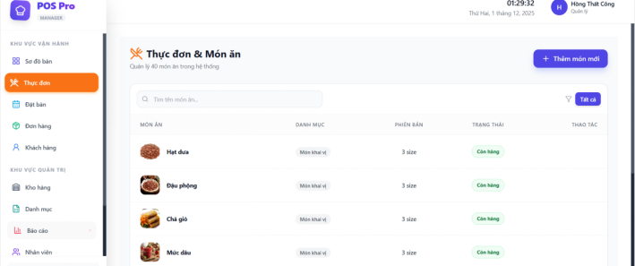
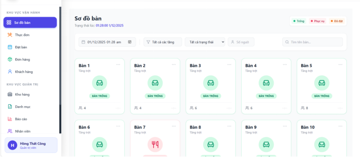
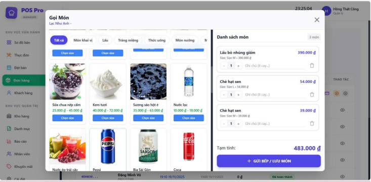
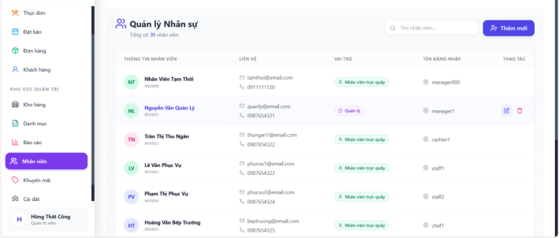

<div align="center">
  <a href="https://github.com/vothaihien/react-restaurant">
    
  </a>

  <h1 align="center">Restaurant Management System</h1>

  <p align="center">
    <b>Next-Gen Web Application for Modern Dining Experiences</b>
    <br />
    A seamless, intuitive, and lightning-fast interface connecting hungry customers with the kitchen.
    <br />
    <br />
    
    
    
    
    
  </p>
</div>

---

<details>
  <summary>📚 <b>Table of Contents</b></summary>
  <ol>
    <li><a href="#-about-the-project">About The Project</a></li>
    <li><a href="#-tech-stack">Tech Stack</a></li>
    <li><a href="#-key-features">Key Features</a></li>
    <li><a href="#-ui-showcase">UI Showcase</a></li>
    <li><a href="#-getting-started">Getting Started</a></li>
    <li><a href="#-project-structure">Project Structure</a></li>
    <li><a href="#-roadmap">Roadmap</a></li>
    <li><a href="#-authors">Authors</a></li>
  </ol>
</details>

---

## 🔭 About The Project

**Restaurant Management System (Client)** is a robust Single Page Application (SPA) designed to streamline restaurant operations. We focus on creating a **seamless** experience for customers while providing powerful management tools for staff.

**Core Objectives:**
* Accelerate the ordering process.
* Minimize errors in the kitchen workflow.
* Provide real-time insights for business owners.

---

## 🛠 Tech Stack

This project leverages the best-in-class frontend ecosystem:

| Technology | Purpose |
| :--- | :--- |
| **React (v18)** | Core UI library using Hooks & Functional Components. |
| **TypeScript** | Ensures type safety and robust code maintainability. |
| **Vite** | Next-gen build tool for lightning-fast HMR and bundling. |
| **Tailwind CSS** | Utility-first framework for rapid and consistent styling. |
| **Axios** | Handles HTTP requests and API integration. |
| **React Router** | Manages client-side navigation and routing. |

---

## ✨ Key Features

### 👤 For Customers
* 🍟 **Interactive Menu:** Browse food with high-quality images and detailed descriptions.
* 🛒 **Smart Cart:** Real-time total calculation and easy order modification.
* 📱 **Responsive Design:** Optimized for both mobile devices and desktops.

### 🛡️ For Admins & Staff
* 📊 **Dashboard:** Visual overview of daily revenue and top-selling items.
* 👨‍🍳 **Kitchen Display:** Real-time order queue tracking (`Pending` -> `Cooking` -> `Done`).
* 👥 **HR Management:** Complete CRUD operations for employee accounts.

---

## 📸 UI Showcase

| **Customer Menu** | **Admin Dashboard** |
|:---:|:---:|
|  |  |

| **Order Tracking** | **Staff Management** |
|:---:|:---:|
|  |  |

---

## 🚀 Getting Started

Follow these steps to set up the project locally.

### Prerequisites
* Node.js (v16.0.0+)
* NPM or Yarn

### Installation

1.  **Clone the repository**
    ```bash
    git clone [https://github.com/vothaihien/react-restaurant.git](https://github.com/vothaihien/react-restaurant.git)
    cd react-restaurant
    ```

2.  **Install dependencies**
    ```bash
    npm install
    ```

3.  **Start the development server**
    ```bash
    npm run dev
    ```

4.  **Access the App**
    Open your browser and navigate to: `http://localhost:5173`

---

## 📂 Project Structure

```text
react-restaurant/
├── public/              # Static assets
├── src/
│   ├── components/      # Reusable UI components
│   ├── pages/           # Application views (Menu, Dashboard...)
│   ├── contexts/        # React Context (State Management)
│   ├── App.tsx          # Main component & Routing
│   └── main.tsx         # Entry point
├── screenshots/         # Images for README
├── package.json         # Dependencies
└── vite.config.ts       # Vite configuration
```

## 🗺️ Roadmap

- [x] Initial Setup & Database Connection
- [x] Customer Menu & Ordering Logic
- [x] Admin Dashboard & Statistics
- [ ] Real-time Notifications (SignalR/Socket)
- [ ] Payment Gateway Integration (Momo/ZaloPay)
- [ ] Multi-language Support (i18n)

---

## 👥 Authors

We are a team of passionate developers building cool things.

<table>
  <tr>
    <td align="center">
      <a href="https://github.com/vothaihien">
        
        <br />
        <sub><b>Vo Thai Hien</b></sub>
      </a>
      <br />
      <span>Project Lead & Front-end</span>
    </td>
    <td align="center">
      <a href="https://github.com/DuyHieu2004">
        
        <br />
        <sub><b>Doan Duy Hieu</b></sub>
      </a>
      <br />
      <span>Front-end</span>
    </td>
  </tr>
</table>

---

## 📝 License

Distributed under the MIT License. See `LICENSE` for more information.

<p align="center">
  <i>Developed with ❤️ for the Graduation Project 2025.</i>
</p>